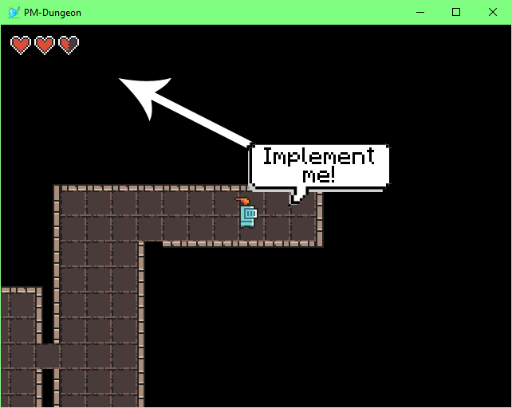

# Quickstart

Dieses Dokument liefert einen Einstieg in das PM-Dungeon. Es erläutert die Installation des Frameworks und die ersten Schritte, um eigene Inhalte zum Dungeon hinzuzufügen. Es dient als Grundlage für alle weiteren Praktika. Lesen Sie das Dokument daher aufmerksam durch und versuchen Sie sich zusätzlich selbst mit dem Aufbau vertraut zu machen.
Das Framework ist in [`core`](https://github.com/PM-Dungeon/core) und [`dungeon-starter`](https://github.com/PM-Dungeon/dungeon-starter) aufgeteilt, wobei `core` das Framework und `dungeon-starter` ein Basis-Starter ist.
Sie benötigen nur das Frontend (`dungeon-starter`) für die Aufgaben, das Backend wird automatisch über Gradle als externe Bibliothek eingebunden.

*Hinweis: Achten Sie darauf, Daten nur dann in öffentliche Git-Repos zu laden, wenn Sie die nötigen Rechte an diesen Daten haben. Dies gilt insbesondere auch für Artefakte wie Bilder, Bitmaps, Musik oder Soundeffekte.*

## Installation

Sie werden das Java SE Development Kit 17.0.x oder höher benötigen.

Für eine Anleitung, wie Sie das Projekt in Ihrer IDE laden können, schauen Sie bitte in das [Dungeon-Starter-Wiki: "Import Project"](https://github.com/PM-Dungeon/dungeon-starter/wiki/Import-Project).

## Arbeiten mit dem Framework

Zu Beginn einige grundlegende Prinzipien, die Sie verstanden haben sollten, bevor Sie mit dem Dungeon arbeiten.

Das PM-Dungeon benutzt aktuell das Cross-Plattform Java-Framework [`libGDX`](https://libgdx.com) als Backend. Dieses ist im `core`- und `dungeon-starter`-Projekt bereits als Abhängigkeit in die Gradle-Konfiguration integriert, Sie müssen dieses nicht extra installieren. Die Ihnen zur Verfügung gestellten Vorgaben sind so umgesetzt, dass Sie kein tieferes Verständnis für das Framework oder `libGDX` benötigen, um die Aufgaben zu lösen. Sollten Sie allerdings einmal auf Probleme stoßen, kann es unter Umständen helfen, einen Blick in die Dokumentation von `libGDX` zu werfen.

Das Framework ist in ein Frontend ([`dungeon-starter`]((https://github.com/PM-Dungeon/dungeon-starter))) und ein Backend ([`core`]((https://github.com/PM-Dungeon/core))) aufgeteilt.
Das Frontend setzt die Parameter, erzeugt ein Fenster und startet die Anwendung.
Das Backend liefert die Schnittstellen, mit denen Sie arbeiten, und integriert die `libGDX`.

Sie selbst schreiben die Logik des Spiels und implementieren die Helden/Monster/Gegenstände.

Bis auf seltene (dokumentierte) Ausnahmen werden Sie nicht gezwungen sein, an den Vorgaben Änderungen durchzuführen.

Sie werden im Laufe der Praktika verschiedene Assets benötigen. Diese liegen per Default im `asset`-Verzeichnis. Sie können das Standardverzeichnis in der `build.gradle` anpassen.
  - Standardpfad für Texturen: `assets/`
  - Standardpfad für Level: `assets/level/files`
  - Standardpfad für Level-Texturen: `assets/textures/level`

## Strukturen

Bevor wir mit der eigentlichen Implementierung des Spiels anfangen, eine kurze Erklärung über den Aufbau des Frameworks.

- Das Framework verwendet sogenannte `Controller` um die einzelnen Aspekte des Spiels zu managen und Ihnen das Leben einfacher zu machen.
    - `EntityController`: Dieser verwaltet alle "aktiven" Elemente wie Helden, Monster, Items etc.
    - `LevelAPI`: Kümmert sich darum, dass neue Level erzeugt und geladen werden.
    - `HUDController`: Verwaltet alle Bildschirmanzeigen die Sie implementieren.
    - `MainController` Verwaltet die anderen `Controller` und beinhaltet die Game-Loop. Ihre Implementierung wird Teil des `MainController`
- Game-Loop: Die Game-Loop ist die wichtigste Komponente des Spieles. Sie ist eine Endlosschleife, welche einmal pro [Frame](https://de.wikipedia.org/wiki/Bildfrequenz) aufgerufen wird. Das Spiel läuft in 30-FPS (also 30 *frames per seconds*, zu Deutsch 30 Bildern pro Sekunde), die Game-Loop wird also 30mal in der Sekunde aufgerufen. Alle Aktionen, die wiederholt ausgeführt werden müssen, wie zum Beispiel das Bewegen und Zeichnen von Figuren, müssen innerhalb der Game-Loop stattfinden. Das Framework ermöglicht es Ihnen, eigene Aktionen in die Game-Loop zu integrieren. Wie genau das geht, erfahren Sie im Laufe dieser Anleitung. *Hinweis: Die Game-Loop wird automatisch ausgeführt, Sie müssen sie nicht aktiv aufrufen.*
- Zusätzlich existieren noch eine Vielzahl an weiteren Helferklassen, mit denen Sie mal mehr oder mal weniger Kontakt haben werden.
- `Painter`: Kümmert sich darum, dass die Inhalte grafisch dargestellt werden.
- `DungeonCamera`: Ihr Auge in das Dungeon.

Das untenstehende UML-Klassendiagramm soll Ihnen einen reduzierten und vereinfachten Überblick über den Aufbau des Frameworks geben. Es bildet daher nicht alle Klassen/Methoden/Attribute ab. Nutzen Sie es als Startpunkt und erforschen Sie die Codebase auf eigene Faust.


## Erster Start

Die Vorgaben sind bereits lauffähig und können direkt ausgeführt werden.
Dafür können Sie die Vorgaben entweder als Projekt in Ihrer IDE laden (siehe ["Import Project"](https://github.com/PM-Dungeon/dungeon-starter/wiki/Import-Project)) und die Anwendung über die Run-Funktion Ihrer IDE starten oder Sie starten die Anwendung über die Kommandozeile per `./gradlew run`.
Gehen Sie dafür in das `dungeon-starter/code`-Verzeichnis und öffnen Sie die Kommandozeile und geben Sie folgenden Befehl ein:
- Unter Windows: `bash gradlew run`
- Unter Linux: `./gradlew run`

_Anmerkung_: Wenn Sie Probleme beim Starten der Anwendung haben, schauen Sie in die [FAQ](https://github.com/PM-Dungeon/dungeon-starter/wiki/FAQ#problem--gradle-konfiguration-wird-nicht-erkannt).Sollten Sie Ihr Problem dennoch nicht lösen können, melden Sie sich bitte **frühzeitig** bei uns.

Das Spiel sollte nun starten und Sie sollten einen Ausschnitt des Levels sehen können.


**Anmerkung**: Wir verwenden in unserem Beispiel zufällig generierte Level, daher werden Sie vermutlich nicht das exakt gleiche Level sehen wie auf unseren Abbildungen.

## Laden des Projekts in der IDE

Bevor wir nun unseren Helden implementieren sollten wir verstehen, wie genau die Vorgaben aufgebaut sind.
Öffnen Sie dafür das `dungeon-starter/code`-Verzeichnis als Gradle-Projekt in Ihrer bevorzugten IDE.

## Blick in den Code

Betrachten wir nun `desktop.MyGame.java`. Diese Klasse ist Ihr Einstiegspunkt in den Dungeon. Hier werden Sie später Ihre Inhalte erzeugen und in den Dungeon hinzufügen.

`MyGame` erbt von `MainController`. Wie der Name schon vermuten lässt, ist der MainController die Haupt-Steuerung des Spiels. Er bereitet alles für den Start des Spieles vor, verwaltet die anderen Controller und enthält die Game-Loop. Wir nutzen `MyGame`, um selbst in die Game-Loop einzugreifen und unsere eigenen Objekte wie Helden und Monster zu verwalten. Der `MainController` ist der Punkt, an dem alle Fäden des Dungeons zusammenlaufen.

`MyGame` implementiert bereits einige Methoden:
- `setup` wird zu Beginn der Anwendung aufgerufen. In dieser Methode werden später die Objekte initialisiert und konfiguriert, welche bereits vor dem Spielstart existieren müssen. In der Vorgabe wird hier bereits das erste Level geladen.
- `beginFrame` wird am Anfang jedes Frames aufgerufen. Hier werden später Abfragen und Berechnungen, wie zum Beispiel Kampfsituationen, implementiert.
- `endFrame` wird am Ende jedes Frames aufgerufen. Hier werden später Abfragen und Berechnungen, wie zum Beispiel Kollisionsüberprüfungen, implementiert.
- `onLevelLoad` wird immer dann aufgerufen, wenn ein Level geladen wird. Hier werden später Monster und Items erstellt, die initial im Level verteilt werden.
- `main` startet das Spiel.

## Eigener Held

Jetzt, wo Sie sichergestellt haben, dass das Dungeon ausgeführt werden kann, geht es darum, das Spiel mit Ihren Inhalten zu erweitern. Im Folgenden wird schrittweise ein rudimentärer Held implementiert, um Ihnen die verschiedenen Aspekte des Dungeon zu erläutern.

Fangen wir damit an, eine neue Klasse für den Helden anzulegen. Unser Held soll grafisch dargestellt werden und vom `EntityController` verwaltet werden können. Daher erbt er von der abtrakten Klasse `basiselements.Entity`.

Diese abstrakte Klasse `basiselements.Entity` liefert einige Methoden, welche wir implementieren müssen.

- `getPosition` gibt an, wo unser Held im Dungeon steht. Weiter unten folgt eine genauere Erklärung des verwendeten Koordinaten- und Positionssystem.
- `getTexture` gibt an, welche Textur verwendet werden soll, wenn unser Held gezeichnet wird.

Wir sollten einige dieser Methoden mit Code füllen.
Zuerst erstellen wir einen Konstruktor für unsere Klasse. Das Framework benötigt eine `com.badlogic.gdx.graphics.g2d.SpriteBatch` und einen `graphic.Painter` um unseren Helden am Ende zeichnen zu können.
Diese bekommt unser Held im Konstruktor als Parameter übergeben und gibt sie im `super()` Aufruf an die Oberklasse weiter. Wir müssen uns nun nicht mehr damit beschäftigen.

```java
import basiselements.Entity;
import com.badlogic.gdx.graphics.g2d.SpriteBatch;
import graphic.Painter;
import tools.Point;

public class MyHero extends Entity {
    public MyHero(Painter painter, SpriteBatch batch) {
        super(painter, batch);
    }

    @Override
    public Point getPosition() {
        return null;
    }

    @Override
    public String getTexturePath() {
        return null;
    }
}
```

Zuerst benötigt unser Held eine Textur, die gezeichnet werden soll, um den Helden darzustellen. Im Framework arbeiten wir immer mit den relativen Pfaden (ausgehend vom `asset/` Verzeichnis), um die Texturen zu laden.
Daher speichern wir einen String mit dem Pfad zu der Textur ab und geben diesen in `getTexturePath()` zurück.

```java
import basiselements.Entity;
import com.badlogic.gdx.graphics.g2d.SpriteBatch;
import graphic.Painter;
import tools.Point;

public class MyHero extends Entity {
    private String texturePath;

    public MyHero(Painter painter, SpriteBatch batch) {
        super(painter, batch);
        texturePath = "character/knight/knight_m_idle_anim_f0.png";
    }

    @Override
    public Point getPosition() {
        return null;
    }

    @Override
    public String getTexturePath() {
        return texturePath;
    }
}
```

Unser Held benötigt aber noch eine Position im Level. Dafür muss unser Held auch das Level kennen. Wir implementieren daher eine `setLevel`-Methode in unserem Helden, speichern das Level ab (das werden wir später noch brauchen) und suchen uns die Startposition im Level und platzieren unseren Helden darauf.

```java
import basiselements.Entity;
import com.badlogic.gdx.graphics.g2d.SpriteBatch;
import graphic.Painter;
import level.elements.Level;
import tools.Point;

public class MyHero extends Entity {
    private String texturePath;
    private Point position;
    private Level currentLevel;

    public MyHero(Painter painter, SpriteBatch batch) {
        super(painter, batch);
        texturePath = "character/knight/knight_m_idle_anim_f0.png";
    }

    public void setLevel(Level level) {
        currentLevel = level;
        position = level.getStartTile().getCoordinate().toPoint();
    }

    @Override
    public Point getPosition() {
        return position;
    }

    @Override
    public String getTexturePath() {
        return texturePath;
    }
}
```

Bevor wir weiter machen, sollten wir uns einmal den Aufbau des Level anschauen. Level werden als 2D-Tile-Array gespeichert. Ein `Tile` ist dabei ein Feld im Level, also eine Wand oder ein Bodenfeld. Jedes `Tile` hat eine feste `Coordinate` im Array (also einen Index, wo im Array das `Tile` abgespeichert ist). Diese `Coordinate` gibt auch an, wo das `Tile` im Level liegt. `Coordinate` sind zwei Integerwerte (`x` und `y`). Die Position von Entitäten geben wir als `Point` an. Ein `Point` sind zwei Floatwerte (`x` und `y`). Das machen wir, weil unsere Entitäten auch zwischen zwei `Tiles` stehen können. Wenn wir später die Steuerung für unseren Helden implementieren, wird dieses noch deutlicher. Jetzt ist wichtig, dass wir mit `Coordinate.toPoint()` unseren Helden auf die Position des Starttiles setzen können.

Wir haben die erste Version unseres Helden implementiert. Jetzt müssen wir ihn noch im Spiel instantiieren.
Dafür gehen wir wieder in `MyGame` und legen eine Variable `MyHero hero` an.
In `setup` erstellen wir nun unseren Helden und registrieren ihn im `EntityController`. Außerdem wollen wir, dass die Kamera auf unseren Helden zentriert wird.
Jetzt müssen wir den Helden nur noch im Dungeon platzieren. Dafür rufen wir die `setLevel`-Methode auf, nachdem ein Level geladen wurde.

```java
import com.badlogic.gdx.Gdx;
import controller.MainController;
import level.generator.LevelLoader.LevelLoader;
import level.generator.dungeong.graphg.NoSolutionException;

public class MyGame extends MainController {
    private MyHero hero;

    @Override
    protected void setup() {
        levelAPI.setGenerator(new LevelLoader());
        hero = new MyHero(painter, batch);
        try {
            levelAPI.loadLevel();
        } catch (NoSolutionException e) {
            System.out.println(
                    "Es konnte kein Level geladen werden, bitte den \"assets\" Ordner überprüfen.");
            Gdx.app.exit();
        }
        camera.follow(hero);
        entityController.add(hero);
    }

    @Override
    protected void beginFrame() {}

    @Override
    protected void endFrame() {}

    @Override
    public void onLevelLoad() {
        hero.setLevel(levelAPI.getCurrentLevel());
    }

    public static void main(String[] args) {
        // start the game
        DesktopLauncher.run(new MyGame());
    }
}
```

Möchten Sie, dass Ihr Hero oder eine andere Entität nicht mehr weiter vom `EntityController` verwaltet wird, z.B. wenn sie "stirbt", überschreiben Sie dafür in der jeweiligen Klasse die Methode `removeable`, die von der `Entity`-Klasse geerbt wurde. Sobald diese Methode den Wert `true` zurückgibt, wird die Instanz im nächsten Frame aus dem `EntityController` entfernt. Wie im Beispiel zu sehen, wird die Entität dann entfernt, wenn die Lebenspunkte auf 0 gefallen sind.

Das folgende Beispiel ist für unseren Helden noch nicht direkt anwendbar (`lebenspunkte` ist noch nicht definiert), aber vielleicht wollen Sie diese Funktionalität irgendwann selbst implementieren.

```java
    @Override
    public boolean removable() {
        return lebenspunkte == 0;
    }
```

Wenn Sie das Spiel nun starten, sollten Sie ihren (unbeweglichen) Helden im Dungeon sehen können.


### Intermezzo: Der Assets-Ordner

Im Ordner [`code/assets/`](https://github.com/PM-Dungeon/dungeon-starter/tree/master/code/assets) werden alle Assets gespeichert, die im Dungeon verwendet werden. Assets sind dabei im Prinzip die Texturen, die später gezeichnet werden sollen.
Der `assets`-Ordner hat aber eine spezielle Adressierung.
Wenn der absolute Pfad zu einer Textur zum Beispiel `code/assets/character/knight/knight_m_idle_anim_f0.png` ist, dann geben wir den relativen Pfad zur Textur mit `character/knight/knight_m_idle_anim_f0.png` an.
Das Präfix `code/assets/` wird dabei also einfach weggelassen.

Bitte finden Sie selbst heraus, welche Texturen es gibt und verwendet werden können.

Der Assets-Ordner kann übrigens auch **umbenannt** oder an eine andere Stelle **verschoben** werden: Passen Sie dafür die Pfadangabe `sourceSets.main.resources.srcDirs = ["assets/"]` in der [`build.gradle`](https://github.com/PM-Dungeon/dungeon-starter/blob/master/code/build.gradle)-Datei an.

**Beispiel:** Sie möchten den Ordner `dungeon-starter/code/assets/` nach `dungeon-starter/code/bar/wuppie/` verschieben, dann ändern Sie `sourceSets.main.resources.srcDirs = ["assets/"]` in `sourceSets.main.resources.srcDirs = ["bar/wuppie/"]`.

Beachten Sie, dass der Ordner nur innerhalb von `dungeon-starter/code/` umbenannt bzw. verschoben werden kann.

Später werden Sie es wahrscheinlich praktischer finden, anstelle von relativen Pfaden den [`textures/TextureHandler.java`](https://github.com/PM-Dungeon/core/blob/master/code/core/src/textures/TextureHandler.java) zu verwenden, der reguläre Ausdrücke entgegennehmen und entsprechende Textur-Pfade zurückgeben kann.

### Der bewegte (animierte) Held

Aktuell besitzt unser Held nur eine feste Textur, in diesem Abschnitt animieren wir unseren Helden.
Im PM-Dungeon ist eine Animation ein Loop verschiedener Texturen, die im Wechsel gezeichnet werden.
Um unseren Helden zu animieren, nutzen wir eine erweiterte Version von `Entity` mit dem Namen `Animatable`.

Die Methode `getTexture` müssen wir nun mit der Methode `getActiveAnimation` ersetzen. Ebenso ersetzen wir unser `texture`-Attribut durch ein Attribut `Animation idleAnimation`.


```java
import basiselements.Animatable;
import com.badlogic.gdx.graphics.g2d.SpriteBatch;
import graphic.Animation;
import graphic.Painter;
import level.elements.Level;
import tools.Point;
import java.util.ArrayList;
import java.util.List;

public class MyHero extends Animatable {
    private Animation idleAnimation;
    private Point position;
    private Level currentLevel;

    public MyHero(Painter painter, SpriteBatch batch) {
        super(painter, batch);
        // Erstellen einer ArrayList
        List<String> animation = new ArrayList<>();
        // Laden der Texturen für die Animation (relativen Pfad angeben)
        animation.add("character/knight/knight_m_idle_anim_f0.png";);
        animation.add("character/knight/knight_m_idle_anim_f1.png";);
        // Erstellen einer Animation, als Parameter wird die Liste mit den Texturen
        // und die Wartezeit (in Frames) zwischen den Wechsel der Texturen angegeben
        idleAnimation = new Animation(animation, 8);
    }

    public void setLevel(Level level) {
        currentLevel = level;
        position = level.getStartTile().getCoordinate().toPoint();
    }

    @Override
    public Point getPosition() {
        return position;
    }

    @Override
    public Animation getActiveAnimation() {
        return idleAnimation;
    }
}
```

Um eine Animation zu erstellen benötigen Sie eine Liste mit verschiedenen Texturen. Dann können Sie mit `new Animation()` eine Animation erstellen. Dabei übergeben Sie die Liste mit den Texturen und einen Integerwert, der angibt, nach wie vielen Frames die nächste Textur geladen werden soll (hier im Beispiel der Wert 8). In unserem Beispiel wird also 8 Frames lang die Textur `knight_m_idle_anim_f0` angezeigt, dann 8 Frames die Textur `knight_m_idle_anim_f1` und dann wieder 8 Frames die Textur `knight_m_idle_anim_f0` usw.

Sie können (und sollten) auch verschiedene Animationen für verschiedene Situationen ertellen (Stehen, Laufen, ...). Geben Sie einfach in `getActiveAnimation` immer die Animation zurück, die gerade verwendet werden soll.

Wenn Sie das Spiel nun starten, sollten Sie Ihren animierten (aber immer noch unbeweglichen) Helden sehen.


### WASD oder die Steuerung des Helden über die Tastatur

Es wird Zeit, dass unser Held sich bewegen kann. Dafür überschreiben wir die `Entity#update`-Methode in `MyHero` und fügen die Steuerungsoptionen hinzu.

```java
import basiselements.Animatable;
import com.badlogic.gdx.Gdx;
import com.badlogic.gdx.Input;
import com.badlogic.gdx.graphics.g2d.SpriteBatch;
import graphic.Animation;
import graphic.Painter;
import level.elements.Level;
import tools.Point;

import java.util.ArrayList;
import java.util.List;

public class MyHero extends Animatable {
    private Animation idleAnimation;
    private Point position;
    private Level currentLevel;

    public MyHero(Painter painter, SpriteBatch batch) {
        super(painter, batch);
        // Erstellen einer ArrayList
        List<String> animation = new ArrayList<>();
        // Laden der Texturen für die Animation (relativen Pfad angeben)
        animation.add("character/knight/knight_m_idle_anim_f0.png";);
        animation.add("character/knight/knight_m_idle_anim_f1.png";);
        // Erstellen einer Animation, als Parameter wird die Liste mit den Texturen
        // und die Wartezeit (in Frames) zwischen den Wechsel der Texturen angegeben
        idleAnimation = new Animation(animation, 8);
    }

    public void setLevel(Level level) {
        currentLevel = level;
        position = level.getStartTile().getCoordinate().toPoint();
    }

    @Override
    public void update() {
        // Temporären Point um den Held nur zu bewegen, wenn es keine Kollision gab
        Point newPosition = new Point(this.position);
        // Unser Held soll sich pro Schritt um 0.1 Felder bewegen.
        float movementSpeed = 0.1f;
        // Wenn die Taste W gedrückt ist, bewege dich nach oben
        if (Gdx.input.isKeyPressed(Input.Keys.W)) {
            newPosition.y += movementSpeed;
        }
        // Wenn die Taste S gedrückt ist, bewege dich nach unten
        if (Gdx.input.isKeyPressed(Input.Keys.S)) {
            newPosition.y -= movementSpeed;
        }
        // Wenn die Taste D gedrückt ist, bewege dich nach rechts
        if (Gdx.input.isKeyPressed(Input.Keys.D)) {
            newPosition.x += movementSpeed;
        }
        // Wenn die Taste A gedrückt ist, bewege dich nach links
        if (Gdx.input.isKeyPressed(Input.Keys.A)) {
            newPosition.x -= movementSpeed;
        }
        // Wenn der übergebene Punkt betretbar ist, ist das nun die aktuelle Position
        if (currentLevel.getTileAt(newPosition.toCoordinate()).isAccessible()) {
            this.position = newPosition;
        }
    }

    @Override
    public Point getPosition() {
        return position;
    }

    @Override
    public Animation getActiveAnimation() {
        return idleAnimation;
    }
}
```

Damit unser Held sich nicht durch Wände bewegt, berechnen wir zuerst die neue Position, kontrollieren dann, ob diese gültig ist, und platzieren dann unseren Helden (oder auch nicht).
Mit `Gdx.input.isKeyPressed` können wir überprüfen, ob eine Taste gedrückt ist.
Je nachdem welche Taste gedrückt wurde, ändern wir die (nächste) Position des Helden.
Mit `level.getTileAt(newPosition.toCoordinate()).isAccessible()` können wir überprüfen, ob es sich bei der neuen Position um ein betretbares `Tile` handelt oder nicht.

Wenn Sie nun das Spiel starten, sollten Sie Ihren Helden bewegen können.
Fügen Sie eine unterschiedliche Animation für jede Laufrichtung hinzu.

### Nächstes Level laden

Da unser Held immer tiefer in das Dungeon gelangen soll, lassen wir jetzt ein neues Level laden, wenn der Held auf die Leiter tritt.

Dafür nutzen wir die `endFrame`-Methode in `MyGame`. Mit `levelAPI.getCurrentLevel().isOnTile()` können wir überprüfen, ob unser Held auf dem EndTile steht. Ist dies der Fall, lassen wir ein neues Level laden.

Da wir unseren Helden in `onLevelLoad` beim Laden eines neuen Levels automatisch neu platzieren, müssen wir uns darum nicht mehr kümmern.

```java
import com.badlogic.gdx.Gdx;
import controller.MainController;
import level.generator.LevelLoader.LevelLoader;
import level.generator.dungeong.graphg.NoSolutionException;

public class MyGame extends MainController {
    private MyHero hero;

    @Override
    protected void setup() {
        levelAPI.setGenerator(new LevelLoader());
        hero = new MyHero(painter, batch);
        try {
            levelAPI.loadLevel();
        } catch (NoSolutionException e) {
            System.out.println(
                    "Es konnte kein Level geladen werden, bitte den \"assets\" Ordner überprüfen.");
            Gdx.app.exit();
        }
        camera.follow(hero);
        entityController.add(hero);
    }

    @Override
    protected void beginFrame() {}

    @Override
    protected void endFrame() {
        if (levelAPI.getCurrentLevel().isOnEndTile(hero)) {
            try {
                levelAPI.loadLevel();
            } catch (NoSolutionException e) {
                e.printStackTrace();
            }
        }
    }

    @Override
    public void onLevelLoad() {
        hero.setLevel(levelAPI.getCurrentLevel());
    }

    public static void main(String[] args) {
        // start the game
        DesktopLauncher.run(new MyGame());
    }
}
```

_Anmerkung_: Später werden Sie viele weitere Entitäten im Level platziert haben (Monster, Schatztruhen, Fallen ...). Diese sollten Sie beim Laden eines neuen Levels löschen oder in das nächste Level "mitnehmen".

Wenn Sie nun das Spiel starten, sollten Sie Ihren Helden durch die Spielwelt bewegen können und auch in das nächste Level gelangen.


## Levelgenerator

Das PM-Dungeon verfügt über einen eigenen prozeduralen Levelgenerator. Dieser ist standardmäßig nicht aktiviert, da unter Umständen die Berechnung von Leveln viel Zeit auf Ihrer Maschine benötigen kann.
Um den prozeduralen Levelgenerator zu verwenden, löschen Sie die Zeile `levelAPI.setGenerator(new LevelLoader());` in `MyGame#setup()`.

## Abschlussworte

Sie haben nun die ersten Schritte im Dungeon gemacht. Von nun an müssen Sie selbst entscheiden, wie Sie die Aufgaben im Praktikum umsetzen möchten. Ihnen ist mit Sicherheit aufgefallen, dass einige Interface-Methoden in diesem Dokument noch nicht erläutert wurden. Machen Sie sich daher mit der Javadoc des [Frameworks](https://github.com/PM-Dungeon/core) vertraut.

## Zusätzliche Funktionen

Hier finden Sie weitere Funktionen, welche Sie im Verlauf des Praktikums gebrauchen können.

### Head-up-Display (HUD)

Dieser Abschnitt soll Ihnen die Werkzeuge nahebringen, welche Sie für die Darstellung eines HUD benötigen.

Um eine Grafik auf dem HUD anzeigen zu können, erstellen wir zuerst eine neue Klasse, welche von der abstrakte Klasse `basiselements.HUDElement` erbt.
`HUDElement` ist vergleichbar mit der bereits bekannten Klasse `Entity`.

```java
import basiselements.HUDElement;
import com.badlogic.gdx.graphics.g2d.SpriteBatch;
import graphic.HUDPainter;
import tools.Point;

public class Icon extends HUDElement {
    private String texturePath;
    private Point position;

    public Icon(HUDPainter painter, SpriteBatch batch, Point position) {
        super(painter, batch);
        texturePath = "hud/ui_heart_full.png";
        this.position = position;
    }

    @Override
    public Point getPosition() {
        return position;
    }

    @Override
    public String getTexturePath() {
        return texturePath;
    }
}
```

Die Methode `getTexturePath` gibt den Pfad zu der gewünschten Textur zurück, dies funktioniert identisch zur bereits bekannten Helden-Implementierung. Die Methode `getPosition` gibt die Position der Grafik auf dem HUD zurück. Es wird vorkommen, dass Sie Grafiken in Abhängigkeit zu anderen Grafiken positionieren möchten, überlegen Sie sich daher bereits jetzt eine gute Struktur, um Ihre HUD-Elemente abzuspeichern.

Jetzt müssen wir unsere Grafik nur noch anzeigen lassen. Ähnlich zu den bereits bekannten Controllern gibt es auch für das HUD eine Steuerungsklasse, welche im `MainController` mit `hud` angesprochen werden kann.

```java
import com.badlogic.gdx.Gdx;
import controller.MainController;
import level.generator.LevelLoader.LevelLoader;
import level.generator.dungeong.graphg.NoSolutionException;
import tools.Point;

public class MyGame extends MainController {
    private MyHero hero;

    @Override
    protected void setup() {
        levelAPI.setGenerator(new LevelLoader());
        hero = new MyHero(painter, batch);
        try {
            levelAPI.loadLevel();
        } catch (NoSolutionException e) {
            System.out.println(
                    "Es konnte kein Level geladen werden, bitte den \"assets\" Ordner überprüfen.");
            Gdx.app.exit();
        }
        camera.follow(hero);
        entityController.add(hero);
        // hinzufügen eines Elementes zum HUD
        hudController.add(new Icon(hudPainter, hudBatch, new Point(0f, 0f)));
        // so entfernt man ein Element
        // hud.remove(OBJECT);
    }

    @Override
    protected void beginFrame() {}

    @Override
    protected void endFrame() {
        if (levelAPI.getCurrentLevel().isOnEndTile(hero)) {
            try {
                levelAPI.loadLevel();
            } catch (NoSolutionException e) {
                e.printStackTrace();
            }
        }
    }

    @Override
    public void onLevelLoad() {
        hero.setLevel(levelAPI.getCurrentLevel());
    }

    public static void main(String[] args) {
        // start the game
        DesktopLauncher.run(new MyGame());
    }
}
```

#### Text im HUD

Verwenden Sie die Methode `HUDController#drawText`, um einen String auf Ihren Bildschirm zu zeichnen. Sie haben dabei eine umfangreiche Auswahl an Parametern, um Ihre Einstellungen anzupassen.`HUDController#drawText` gibt Ihnen ein `Label`-Objekt zurück, dieses können Sie verwenden, um den Text später anzupassen oder ihn vom Bildschirm zu entfernen. Um den Text anzupassen, können Sie `label.setText("new String")` verwenden und um das Label zu löschen, können Sie `label.remove()` verwenden.

Im unteren Beispiel wird ein Text implementiert, welcher das aktuelle Level ausgibt.

```java
public class MyGame extends MainController {
    import com.badlogic.gdx.graphics.Color;
    ...

    private com.badlogic.gdx.scenes.scene2d.ui.Label levelLabel;
    private int levelCounter=0;

    public void onLevelLoad() {
        levelCounter++;
        if (levelCounter==1){
            levelLabel=hudController.drawText("Level "+levelCounter,"PATH/TO/FONT.ttf",Color.RED,30,50,50,30,30);
        }
        else{
            levelLabel.setText("Level "+levelCounter);
        }
    }
    //remove label
    //levelLabel.remove();
}
```

Beachten Sie dabei, dass `PATH/TO/FONT.ttf` wieder ein relativer Pfad, ausgehend vom `asset`-Verzeichnis ist.
Freie Fonts können Sie im Internet finden. Achten Sie bitte genau darauf, ob Sie die von Ihnen verwendeten Fonts weiterverbreiten dürfen, bevor Sie diese in Ihr Git-Repository hochladen.
Aktuell wissen wir, dass Fonts vom Typ `.ttf` unterstützt werden; ob andere Font-Typen wie `.otf` ebenfalls unterstützt werden, wissen wir leider nicht. Sollten Sie Erfahrungen mit anderen Font-Typen gemacht haben/machen, dann informieren Sie uns bitte.

Genauere Informationen zu den Parametern entnehmen Sie bitte der JavaDoc.



### Level-API

Sie haben viele Möglichkeiten mit dem Level zu interagieren.
Schauen Sie in die [Javadoc](https://github.com/PM-Dungeon/core) um herauszufinden, wie Sie optionale Räume identifizieren oder Wände wegsprengen können.
