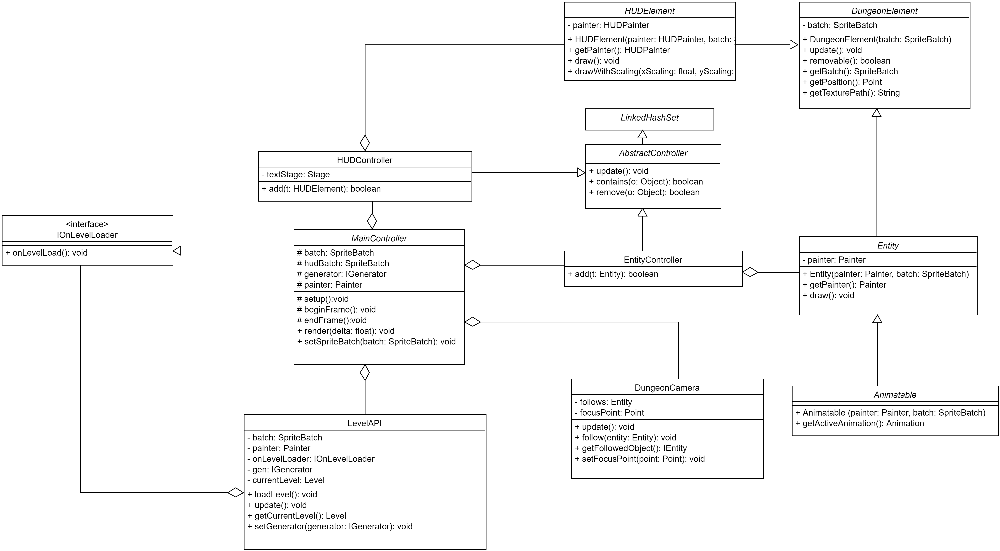
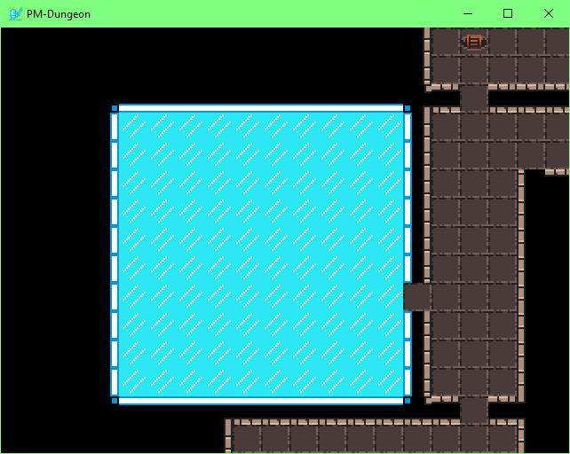
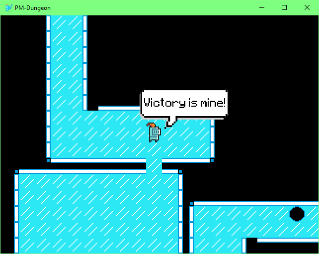
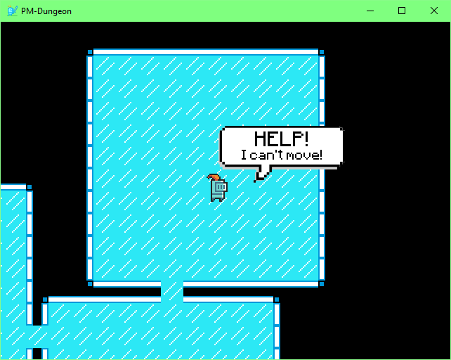
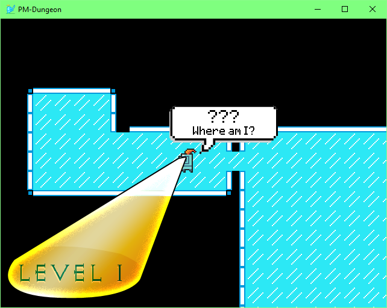
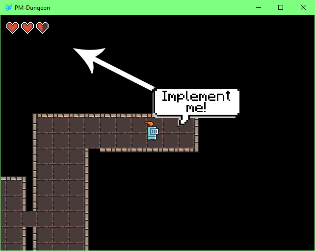

# Quickstart

**THIS QUICKSTART USES CORE 3.0.+ IS OUTDATED FOR CORE 4.0.+**

This document provides an introduction to the PM-Dungeon. It explains the installation of the framework and the first steps to add your own content to the dungeon.
The framework is divided into `core` and `desktop`, where `core` is the framework and `desktop` is a basic starter.


## Installation

You will need the Java SE Development Kit 17.0.x or higher.

To use the PM-Dungeon framework, create a fork of the [`desktop` repository](https://github.com/PM-Dungeon/desktop) and pull a local clone onto your device.

## Working with the framework

To start with, here are some basic principles you should understand before working with the Dungeon.

The PM-Dungeon currently uses the cross-platform Java framework [`libGDX`](https://libgdx.com) as a backend. This is already integrated in the `core` and `desktop` project as a dependency in the Gradle configuration, you do not need to install it separately. The provided PM-Dungeon-Framework is implemented in such a way that you do not need a deeper understanding of the framework or `libGDX` to solve the tasks. However, should you encounter problems, it may help to have a look at the documentation of `libGDX`.

The framework is divided into a frontend ([`desktop`]((https://github.com/PM-Dungeon/desktop))) and a backend ([`core`]((https://github.com/PM-Dungeon/core)).
The frontend sets the parameters, creates a window and starts the application.
The backend provides the interfaces you work with and integrates the `libGDX`.

You write the logic of the game and implement the heroes/monsters/items.

With rare (documented) exceptions, you will not be forced to make changes to the specifications.

You will need various assets. By default, these are located in the `asset` directory. You can adjust the default directory in `build.gradle`.
- Default path for textures: `assets/`
- Default path for levels: `assets/level/files`.
- Default path for level textures: `assets/textures/level`

## Structures

Before we start with the actual implementation of the game, a short explanation about the structure of the framework.

- The framework uses so-called `Controllers` to manage the different aspects of the game and to make your life easier.
    - `EntityController`: This manages all the 'active' elements such as heroes, monsters, items, etc.
    - `LevelAPI`: Takes care of creating and loading new levels.
    - `HUDController`: Manages all screen displays that you implement.
    - `MainController`: Manages the other controllers and includes the game loop. Your implementation becomes part of the `MainController`.
- Game-Loop: The game loop is the most important component of the game. It is an infinite loop that is called once per [frame](https://en.wikipedia.org/wiki/Frame_rate). The game runs in 30 FPS (30 *frames per second*), so the game loop is called 30 times per second. All actions that have to be executed repeatedly, such as moving and drawing characters, must take place within the game loop. The framework allows you to integrate your own actions into the game loop. You will learn exactly how to do this in the course of this tutorial
*Note: The game loop is executed automatically, you do not have to actively call it up.*
- In addition, there are a number of other helper classes.
- `Painter`: Takes care that the contents are displayed graphically.
- `DungeonCamera`: Your eye into the dungeon.
- Different interfaces, which you will get to know in the course of this document.

The UML class diagram below is intended to give you a reduced and simplified overview of the structure of the framework. It therefore does not represent all classes/methods/attributes. Use it as a starting point and explore the codebase on your own.



## First start

The files given in the [`desktop` repository](https://github.com/PM-Dungeon/desktop) are already executable and can be run directly.
To do this, you can either load the presets as a project in your IDE and start the application via the run function or you can start the application via the command line.
To do this, go to the `desktop/code` directory, open the command line and enter the following command:

- If you are using Windows: `bash gradlew run`
- If you are running Linux: `./gradlew run`

_Note_: If you have problems starting the application, please check the [FAQ](https://github.com/PM-Dungeon/desktop/wiki/FAQ#problem--gradle-konfiguration-wird-nicht-erkannt). If you still cannot solve your problem, please contact us **early**.

The game should now start and you should be able to see a section of the level for the first time.



**Note**: We use randomly generated levels in our example, so you probably won't see the exact same level as in our illustrations.

## A look at the code

Now, before we implement our hero we should understand how the sample project and its corresponding code is structured.
To do this, open the `desktop/code` directory as a Gradle project in your favourite IDE.

Let us now look at `desktop.MyGame.java`. This class is your entry point into the dungeon. This is where you will later create your content and add it to the dungeon.

`MyGame` inherits from MainController. As the name suggests, the `MainController` is the main controller of the game. It prepares everything for the start of the game, manages the other controllers and contains the game loop. We use `MyGame` to intervene in the game loop ourselves and to manage our own objects such as heroes and monsters. The `MainController` is the point where all the threads of the dungeon come together.

`MyGame` already implements some methods:
- `setup` is called at the beginning of the application. This method will later initialise and configure the objects that must already exist before the game starts. By default, the first level is already loaded here.
- `beginFrame` is called at the beginning of each frame. Queries and calculations, such as combat situations, will be implemented here.
- `EndFrame` is called at the end of each frame. This is where queries and calculations, such as collision checks, are implemented.
  `OnLevelLoad` is called whenever a level is loaded. This is where monsters and items are created, which are initially distributed in the level.
- `main` starts the game.

## Your own hero

Now that you have ensured that the dungeon can be run, it is a matter of expanding the game with your content. Below we will implement a rudimentary hero to help you understand the different aspects of the dungeon.

Let's start by creating a new class for the hero. Our hero should be represented graphically and be able to be managed by the `EntityController`. Therefore, it implements the interface `IEntity`.

The interface `IEntity` provides some methods which we have to implement.

- `update`: This method is later called once in each frame by the `EntityController`. Changes to the status of the hero, such as the position, are calculated here.
- `removeable`: If this method returns `true`, the object is removed from the `EntityController` and is no longer managed. For example, if our hero defeats a monster, it should return `true` after its death.
- `getBatch`: The SpriteBatch is the drawing surface on which our object should be drawn. Each entity must know what it is to be drawn on.
- `getPainter` is the painter that draws our object. Each entity needs to know who it is being drawn by.
- `getPosition` indicates where our hero is standing in the dungeon. Below is a more detailed explanation of the coordinate and position system used.
- `getTexture` specifies which texture to use when our hero is drawn.

We should fill some of these methods with code.
The `SpriteBatch` and the `Painter` are passed to our hero during creation. Therefore, we create attributes and create a constructor for our hero. We can already implement the texture for our hero. For this, we specify the path to our texture as a string.

```java
    private Painter painter;
    private SpriteBatch batch;
    private String texture;

    public MyHero(SpriteBatch batch, Painter painter){
        this.batch=batch;
        this.painter=painter;
        texture=("assets_path_to_texture/held.png");
    }
```

In the respective `get`-methods we now return the corresponding values.

However, our hero still needs a position in the level. For this, our hero must also know the level. We therefore implement a `setLevel` method in our hero, save the level (we will need this later) and look for the starting position in the level and place our hero on it.

```java
   public void setLevel(Level level){
        this.level=level;
        position=level.getStartTile().getCoordinate().toPoint();
    }
```

Before we continue, we should take a look at the structure of the level. Levels are saved as 2D tile arrays. A 'tile' is a field in the level, i.e. a wall or a floor field. Each 'tile' has a fixed 'coordinate' in the array (i.e. an index where the 'tile' is stored in the array). This `coordinate` also indicates where the `tile` is located in the level. Coordinates are two integer values (x and y). We specify the position of entities as `Point`. A `Point` is two float values (`x` and `y`). We do this because our entities can also be between two `tiles`. Later, when we implement the controls for our hero, this will become even clearer. Now it is important that we can use `Coordinate.toPoint()` to set our hero to the position of the starting tile.

We still have to make sure that our hero is also drawn. Since our hero will later be managed by the `EntityController`, we use the `update` method for this.

```java
    @Override
    public void update() {
        draw();
    }
```

The method `draw()` is a pre-implemented method in the interface `IEntity` and ensures that our hero is drawn at the appropriate position in the dungeon.

We have implemented the first version of our hero. Now we still have to instantiate him in the game.
To do this, we go back to `MyGame` and create a variable `MyHero hero`.
In `setup` we now create our hero and register him in `EntityController`. We also want the camera to be centred on our hero.

```java
    @Override
    protected void setup() {
        hero = new MyHero(batch, painter);
        entityController.add(hero);
        camera.follow(hero);
        // load the first level
        ...
    }
```

Now we just have to place the hero in the dungeon. To do this, we call the `setLevel` method after a level has been loaded.


```java
    @Override
    public void onLevelLoad() {
        hero.setLevel(levelAPI.getCurrentLevel());
    }
```

When you start the game, you should be able to see your (rather immobile) hero in the dungeon.



### Intermezzo: The Assets Folder

In the folder [`code/assets/`](https://github.com/PM-Dungeon/desktop/tree/master/code/assets) all assets that will be used in the dungeon are stored. Assets are basically the textures that will be drawn later.
However, the `assets` folder has special addressing.
For example, if the absolute path to a texture is `code/assets/character/knight/knight_m_idle_anim_f0.png`, then we specify the relative path to the texture as `character/knight/knight_m_idle_anim_f0.png`.
The prefix `code/assets/` is thus simply omitted.

Please find out for yourself which textures exist and can be used.

The assets folder can also be **renamed** or **moved** to another location: To do this, adjust the path `sourceSets.main.resources.srcDirs = ["assets/"]` in the [`build.gradle`](https://github.com/PM-Dungeon/desktop/blob/master/code/build.gradle) file.

**Example:** You want to move the folder `desktop/code/assets/` to `desktop/code/bar/wuppie/`, then change `sourceSets.main.resources.srcDirs = ["assets/"]` to `sourceSets.main.resources.srcDirs = ["bar/wuppie/"]`.

Note that the folder can only be renamed/moved within `desktop/code/`.

Later you will probably find it more convenient to use [`textures/TextureHandler.java`](https://github.com/PM-Dungeon/core/blob/master/code/core/src/textures/TextureHandler.java) instead of relative paths, which can take regular expressions and return appropriate texture paths.

***

### The moving (animated) hero

Currently, our hero has only one fixed texture, in this section, we animate our hero.
In the PM dungeon, an animation is a loop of different textures that are drawn in alternation.
To animate our hero we use an extended version of the `IEntity` interface `IAnimatable`.

`public class MyHero implements IAnimatable`.

We now need to replace the `getTexture` method with the `getActiveAnimation` method. Similarly, we replace our `texture` attribute with an attribute `idle` (`private Animation idle`).

```java
    @Override
    public Animation getActiveAnimation() {
        return idle;
    }
```

Now we still have to create the animation. To do this, we go back to the constructor of our hero.

```java
public MyHero(SpriteBatch batch, Painter painter) {
    this.batch=batch;
    this.painter=painter;

    // create an ArrayList
    List<String> animation = new ArrayList<>();
    // load the texture(s) of the animation (use the relative path)
    animation.add("assets_path_to_texture/texture_1.png");
    animation.add("assets_path_to_texture/texture_2.png");
    // creation of the animation. As parameter the list of animation textures and
    // the time between swapping of animation textures must be specified during
    // creation.
    idle = new Animation(animation, 8);
}
```

To create an animation you need a list of different textures. Then you can create an animation with `new Animation()`. You pass the list with the textures and an integer value that indicates after how many frames the next texture should be loaded (here in the example the value 8). So in our example the texture `texture_1` is displayed for 8 frames, then the texture `texture_2` for 8 frames and then again the texture `texture_1` for 8 frames and so on.

You can (and should) also create different animations for different situations (standing, walking, ...). Just return in `getActiveAnimation` always the animation that should be used at the moment.

When you start the game, you should see your animated (but still immobile) hero.



### WASD or the control of the hero via the keyboard

It is time for our hero to be able to move. For this we add control options in the `MyHero#update`-Method:

```java
    // a temporary point to move the hero if no collision was detected
    Point newPosition = new Point(this.position);
    // our hero should move along at 0.1 fields per step.
    float movementSpeed = 0.1f;
    // if the key W is pressed, move up
    if (Gdx.input.isKeyPressed(Input.Keys.W)) newPosition.y += movementSpeed;
    // if the key S is pressed, move down
    if (Gdx.input.isKeyPressed(Input.Keys.S)) newPosition.y -= movementSpeed;
    // if the key D is pressed, move right
    if (Gdx.input.isKeyPressed(Input.Keys.D)) newPosition.x += movementSpeed;
    // if the key A is pressed, move left
    if (Gdx.input.isKeyPressed(Input.Keys.A)) newPosition.x -= movementSpeed;
    // if the given point is reachable, this is our new position
    if(level.getTileAt(newPosition.toCoordinate()).isAccessible())
        this.position = newPosition;
```

To prevent our hero from moving through walls, we first calculate the new position, then check whether it is valid and then place our hero (or not).
With `Gdx.input.isKeyPressed` we can check if a key is pressed.
Depending on which key was pressed, we change the (next) position of the hero.
With `level.getTileAt(newPosition.toCoordinate()).isAccessible()` we can check if the new position is an accessible `Tile` or not.

When you now start the game, you should be able to move your hero.
Add a different animation for each walking direction.

### Load next level

Since we want our hero to get deeper and deeper into the dungeon, we now have a new level loaded when the hero steps on the ladder.

For this, we use the `endFrame` method in `MyGame`. With `levelAPI.getCurrentLevel().isOnTile()` we can check if our hero is standing on the EndTile. If this is the case, we load a new level.

Since we automatically reposition our hero in `onLevelLoad` when loading a new level, we don't have to worry about this anymore.

```java
    @Override
    protected void endFrame() {
        if(levelAPI.getCurrentLevel().isOnEndTile(hero))
            levelAPI.loadLevel();
    }
```

_Note_: Later you will have placed many more entities in the level (monsters, treasure chests, traps ...). You should delete these when loading a new level or "take" them with you to the next level.

When you now start the game, you should be able to move your hero through the game world and also get to the next level.



## Level generator

The PM Dungeon provides its own procedural level generator. This is not enabled by default, because in some circumstances the calculation of levels can take a lot of time on your machine. To use the procedural level generator, delete the line `levelAPI.setGenerator(new LevelLoader());` in `MyGame#setup()`.

## Final words

You have now made the first steps in the dungeon. From now on, you have to decide for yourself how and what you want to implement in your dungeon. You will have noticed that some interface methods have not yet been explained in this document. Therefore, familiarise yourself with the Javadoc of the [Framework](https://github.com/PM-Dungeon/core).

## Additional functions

Here you will find additional functions that you may want to use.

### Head-up Display (HUD)

This section will introduce you to the tools you need to display a HUD.

To be able to display a graphic on the HUD, we first create a new class that implements the interface `IHUDElement`.


```java
public class MyIcon implements IHUDElement {
    private SpriteBatch batch;
    private HUDPainter painter;
    private Point position;
    private String texture;

    public MyIcon(SpriteBatch batch, HUDPainter painter, Point position, String texture) {
        this.batch = batch;
        this.painter = painter;
        this.position = position;
        this.texture = texture;
    }

    @Override
    public void update() {
        this.draw();
        // this.drawWithScaling(8, 4);
    }

    @Override
    public boolean removable() {
        return false;
    }

    @Override
    public SpriteBatch getBatch() {
        return batch;
    }

    @Override
    public Point getPosition() {
        return position;
    }

    @Override
    public String getTexture() {
        return texture;
    }

    @Override
    public HUDPainter getPainter() {
        return painter;
    }
}
```

The method `getTexture` returns the path to the desired texture, this works identically to the already known hero implementation. The method `getPosition` returns the position of the graphic on the HUD. There will be times when you want to position graphics in relation to other graphics, so think about a good structure to store your HUD elements already now.

Now we just need to display our graphics. Similar to the already known controllers, there is also a control class for the HUD, which can be addressed in the `MainController` with `hud`.

```java
public class YourClass extends MainController {
     @Override
    protected void setup() {
        ...
        // add an element to the hud
        hudController.add(
                new MyIcon(
                        hudBatch,
                        hudPainter,
                        new Point(0f, 0f),
                        TextureHandler.getInstance().getTextures("ui_heart_full.png").get(0)));
        // this is how you delete an hud element
        //hud.remove(OBJECT);
    }
}
```

#### Text in the HUD

Use the `HUDController#drawText` method to draw a string on your screen. You have a wide range of parameters to adjust your settings.`HUDController#drawText` returns a `label` object, you can use this to adjust the text later or remove it from the screen. To customise the text you can use `label.setText("new String")` and to delete the label you can use `label.remove()`.

In the example below, a text is implemented that displays the current level.

```java
public class MyGame extends MainController {
    .....
    Label levelLabel;
    int levelCounter=0;

    public void onLevelLoad() {
        levelCounter++;
        if (levelCounter==1){
            levelLabel=hudController.drawText("Level "+levelCounter,"PATH/TO/FONT.ttf",Color.RED,30,50,50,30,30);
        }
        else{
            levelLabel.setText("Level "+levelCounter);
        }
    }
    //remove label
    //levelLabel.remove();
}
```

For more detailed information on the parameters, please refer to the JavaDoc.



### Level API

You have many ways to interact with the level.
Check out the [Javadoc](https://github.com/PM-Dungeon/core) to find out how to identify optional rooms or blow away walls.

### Sound

If you want to add sound effects or background music to your dungeon, `libGDX` offers an easy way to do so.

The formats `.mp3`, `.wav` and `.ogg` are supported. The procedure does not differ between the formats.

```java
// load the file as a sound object
Sound mySound = Gdx.audio.newSound(Gdx.files.internal("assets/sound/sound.mp3"));
mySound.play();
// play the sound at a volume level of 10%
mySound.play(0.1f);
// play the sound at maximum volume
mySound.play(1f);
// loop the sound endlessly
mySound.loop();
```

You can use other parameters and methods to adjust the sound to your liking. See the [`libGDX` documentation](https://libgdx.badlogicgames.com/ci/nightlies/docs/api/com/badlogic/gdx/audio/Sound.html).
